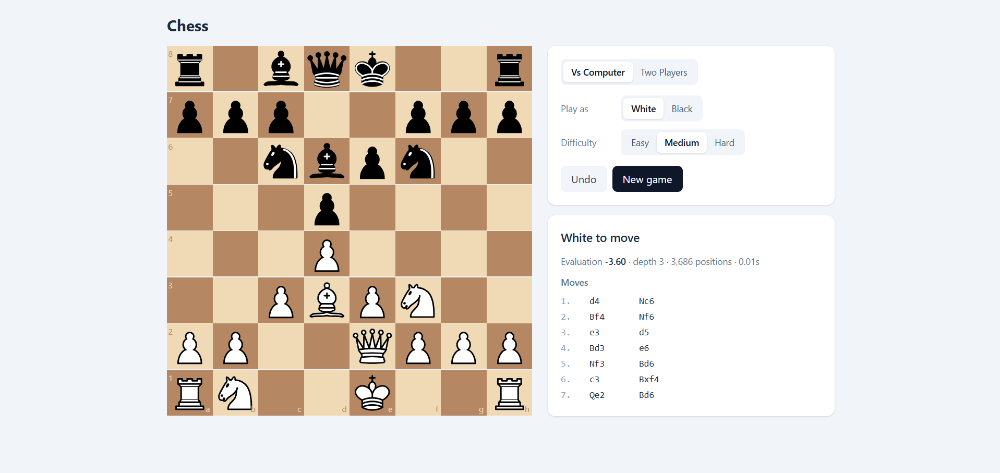
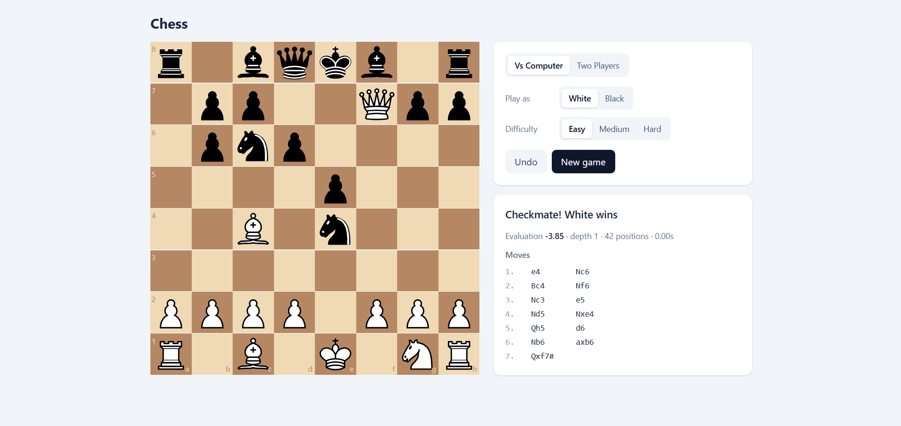

# Chess AI

   

A chess game with a chess engine written from scratch in C++. Play against the engine at three difficulty levels, or play a friend on the same screen.

**🔗 Live demo:** https://YOUR-VERCEL-URL.vercel.app

> The engine runs on a free tier and sleeps when idle, so its first move may take up to a minute while it wakes up. The free server also has limited CPU, so it searches less deeply than it does on a normal machine.



## Features

- **Custom C++ chess engine:** legal move generation, position evaluation, and search, all written from scratch
- **Three difficulty levels:** easy, medium, and hard, controlled by search depth and time limit
- **Play as White or Black** against the engine, or two players on one screen
- **Live engine stats:** evaluation, search depth, positions examined, and thinking time for every engine move
- **Complete rules:** castling, en passant, promotion, checkmate, stalemate, and draw detection

## Engine

### Move generation

- 64-square board representation with copy-make move application
- Pseudo-legal generation filtered by king-safety checks, covering castling (including through-check rules), en passant, and all four promotion types
- **Verified with perft:** exact node counts match the published reference values on five standard test positions, including Kiwipete and other positions designed to catch edge-case bugs
- **15.5 million positions per second** (perft depth 5 from the start position: 4,865,609 nodes in 0.31 s)

### Search

- **Negamax with alpha-beta pruning**
- **Iterative deepening** with a time limit, keeping the result of the deepest completed search
- **Move ordering** (MVV-LVA captures and promotions first, previous best move first) to maximize pruning
- **Quiescence search** over captures to avoid the horizon effect
- Mate-distance scoring, so the engine prefers faster checkmates
- Reaches **depth 6 in about 2 seconds** from the starting position

### Evaluation

- Material balance (centipawns)
- Piece-square tables for every piece type, with separate middlegame and endgame king tables

### Testing

14 GoogleTest unit tests: perft on five reference positions, FEN parsing round-trips, checkmate detection, and tactical search tests (back-rank mate, Scholar's Mate, winning a hanging queen).



## Tech Stack

| Layer | Technology |
|-------|------------|
| Engine | C++20, CMake |
| Engine API | cpp-httplib, nlohmann/json |
| Testing | GoogleTest |
| Frontend | React, chess.js, react-chessboard, Tailwind CSS, Vite |
| Deployment | Docker (multi-stage build), Render, Vercel |

## Project Structure

```
chess-ai/
├── engine/
│   ├── src/
│   │   ├── board.h/.cpp       # Board representation, FEN, move generation
│   │   ├── evaluate.h/.cpp    # Material and piece-square evaluation
│   │   ├── search.h/.cpp      # Alpha-beta search, quiescence, iterative deepening
│   │   ├── server.cpp         # HTTP API
│   │   ├── perft_main.cpp     # Perft benchmarking tool
│   │   └── search_main.cpp    # Command-line best-move tool
│   ├── tests/                 # GoogleTest suite
│   ├── CMakeLists.txt
│   └── Dockerfile
└── frontend/                  # React chessboard UI
```

## API

`POST /move`

```json
{ "fen": "rnbqkbnr/pppppppp/8/8/8/8/PPPPPPPP/RNBQKBNR w KQkq - 0 1", "difficulty": "medium" }
```

Returns the best move in UCI notation along with the score, search depth, positions examined, and time taken.

## Running Locally

**Prerequisites:** a C++20 compiler, CMake 3.20+, Ninja, and Node.js 20+.

### Engine

```bash
cd engine
cmake -S . -B build-release -G Ninja -DCMAKE_BUILD_TYPE=Release
cmake --build build-release
./build-release/server             # API on http://localhost:8080
./build-release/perft 5            # move generation benchmark
./build-release/engine_tests       # test suite
```

### Frontend

```bash
cd frontend
npm install
npm run dev                        # http://localhost:5173
```